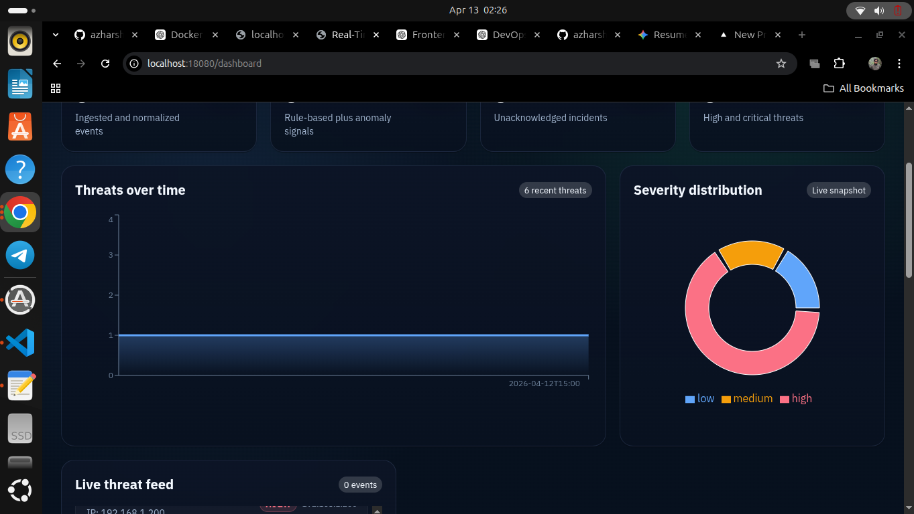
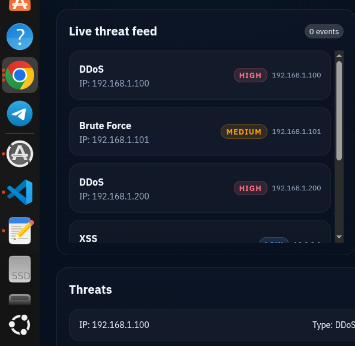

# Real-Time Threat Monitoring & Analysis Platform

Full-stack threat monitoring app with:
- FastAPI backend
- MongoDB storage
- React dashboard
- Docker Compose orchestration

The current backend API stores threat records and returns them for dashboard visualization.

## Dashboard Screenshots



Main dashboard view with threat timeline, severity distribution, and live threat feed.



Detailed live threat feed showing threats by IP address with severity badges.

## Project Structure

```text
backend/        FastAPI app and API endpoints
frontend/       React dashboard UI
docker/         Backend and frontend Dockerfiles
nginx/          Reverse proxy config
docker-compose.yml
```

## What Works Right Now

- `POST /threat` saves threats in MongoDB.
- `GET /threats` returns all stored threats.
- Frontend dashboard fetches `/threats` and renders records, charts, and feed.
- CORS is enabled for local development.

## Prerequisites

- Docker Engine
- Docker Compose v1 (`docker-compose`) or v2 (`docker compose`)

## Run Locally (Recommended)

Run commands from repository root:

```bash
cd "/home/azhar/Real-Time Threat Monitoring & Analysis Platform"
docker-compose down
docker-compose up -d --build
```

## Service URLs

- Backend API: `http://localhost:8001`
- Frontend (via NGINX): `http://localhost:18080`
- MongoDB host port: `localhost:27019`

## Live Deployment

- Frontend: `https://real-threaddd.onrender.com/dashboard`
- Backend Docs: `https://real-threadd.onrender.com/docs`

The frontend is built with `VITE_API_BASE_URL=http://localhost:8001` by default so the browser can reach the backend directly during local development.

## API Usage

### Create Threat

```bash
curl -X POST http://localhost:8001/threat \
   -H "Content-Type: application/json" \
   -d '{"ip":"8.8.8.8","threat_type":"Malware","severity":"high"}'
```

Response:

```json
{"message":"Threat stored successfully"}
```

### List Threats

```bash
curl http://localhost:8001/threats
```

Sample response:

```json
[
   {
      "ip": "8.8.8.8",
      "threat_type": "Malware",
      "severity": "high",
      "timestamp": "2026-04-13T10:23:12.123456"
   }
]
```

## Frontend Data Flow

Dashboard fetches threat data from:

`http://localhost:8001/threats`

Each record expects:
- `ip`
- `threat_type`
- `severity`
- `timestamp` (optional, dashboard safely handles missing values)

## Troubleshooting

### 1. Compose file not found

Error:
`Can't find a suitable configuration file in this directory`

Fix:

```bash
cd "/home/azhar/Real-Time Threat Monitoring & Analysis Platform"
```

### 2. Port already allocated (Mongo 27019)

Error:
`Bind for 0.0.0.0:27019 failed: port is already allocated`

Fix:

```bash
docker ps --format "table {{.Names}}\t{{.Ports}}"
docker rm -f <container_using_27019>
docker-compose up -d --build
```

### 3. docker-compose v1 `ContainerConfig` error

If you see KeyError `ContainerConfig`, clear stale project containers and restart:

```bash
docker rm -f $(docker ps -aq --filter "name=real-timethreatmonitoringanalysisplatform") 2>/dev/null || true
docker network rm real-timethreatmonitoringanalysisplatform_default 2>/dev/null || true
docker-compose -p rtmap up -d --build
```

## Development Notes

- Backend app entrypoint: [backend/app/main.py](backend/app/main.py)
- Dashboard component: [frontend/src/components/Dashboard.jsx](frontend/src/components/Dashboard.jsx)
- Compose config: [docker-compose.yml](docker-compose.yml)
